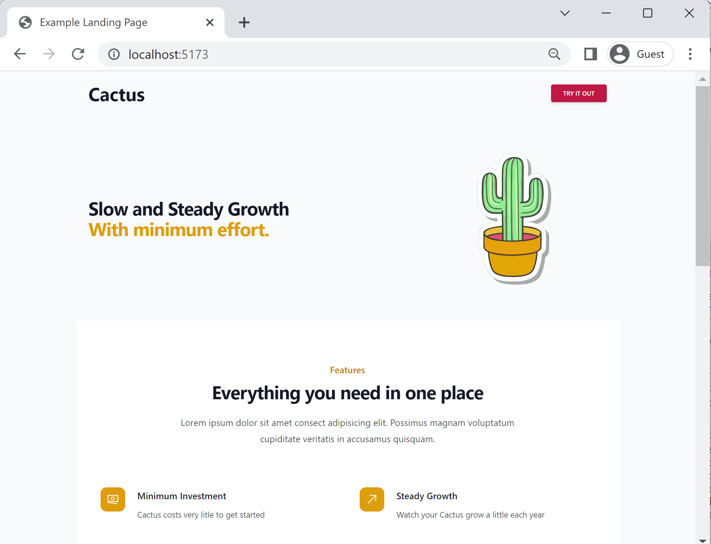

# App Landing Page with Vite + React + Tailwind

Live demo of this landing page is deployed to [workwithcactus.com](https://workwithcactus.com/)


This is the source code for the app landing page example used in a number of articles on both [traintocode.com](htttps://traintocode.com) and on [YouTube](https://www.youtube.com/@traintocode/?sub_confirmation=1).  The full end to end guide for creating this landing page can be found here:

[Simple marketing website with tailwind CSS and React](https://www.traintocode.com/marketing-website-with-tailwind-and-react
)



## Running Locally

The project is build with [Vite](https://vitejs.dev/) you can run it locally with:

```sh
npm install

npm run dev
```
